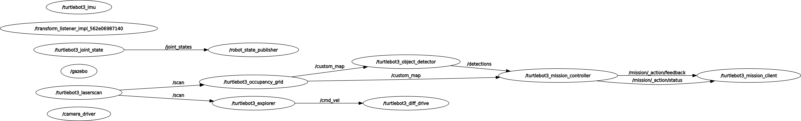

# Turtlebot Mapper

The package's goal is to use the robot [turtlebot3](https://github.com/ROBOTIS-GIT/turtlebot3) with a laser scan in a partially known environment to count the number of obstacles in this environment. The proposed solution aims to be as generic as possible. Given a closed environment, the robot must continue exploring until the number of frontier points (intersection between unknown regions and free regions) reaches a threshold.

* [turtlebot3_occupancy_grid](turtlebot3_mapper/turtlebot3_occupancy_grid/turtlebot3_occupancy_grid.py): it subscribes to receive messages from the laser sensor and updates the occupancy grid map for each message received. Initially, all points on the occupancy map have probability equal to 50%. As messages are received from the laser sensor, occupied points will have probability above 50% and free points on the map will have probability below 50%. This probabilistic occupancy grid is published at a fixed rate in the `custom_map` topic.

* [turtlebot3_object_detector](turtlebot3_mapper/turtlebot3_object_detector/turtlebot3_object_detector.py): it subscribes to receive messages from `turtlebot3_occupancy_grid` with the probabilistic occupancy grid. For each message received, the map is segmented into a threshold ensuring that only points with a probability greater than this threshold are 1. Then, [OpenCV's connected components](https://docs.opencv.org/3.4/d3/dc0/group__imgproc__shape.html#ga107a78bf7cd25dec05fb4dfc5c9e765f) approach is used these determine occupied regions. If this region's area is between a minimum and maximum value, then it publish the [BoundingBox2DArray](http://docs.ros.org/en/api/vision_msgs/html/msg/BoundingBox2DArray.html) and an [Image](http://docs.ros.org/en/noetic/api/sensor_msgs/html/msg/Image.html) with everything rendered to visualize the results.

* [turtlebot3_explorer](turtlebot3_mapper/turtlebot3_explorer/turtlebot3_explorer.py): it subscribes to receive messages from the laser sensor and publishes velocity commands. If any obstacle is detected in front of the robot, it then rotates until it finds a free path again. Also has a service that allows to enable or disable this behavior.

* [turtlebot3_mission_controller](turtlebot3_mapper/turtlebot3_mission_controller/turtlebot3_mission_controller.py): the main service of this node is an action server responsible for determining when the exploration starts and ends. To do so, it uses the concept of fronteirs (intersection between unknown regions and free regions). Through the objective sent to the action server, where a user can specify the number of remaining fronteir points, it will enable the `turtlebot3_explorer` to explore the enviromment until it reaches the specified numbers of frontiers points in the occupancy grid.

* [turtlebot3_mission_client](turtlebot3_mapper/turtlebot3_mission_client/turtlebot3_mission_client.py): action client responsible for sending the exploration task to the action server and saving the results to a file.

Below you can see a graph of the entire system,



## Building package

If you don't already have a workspace where you want to add this package, then create one:
```bash
mkdir -p ros2_ws/src
cd ros2_ws
```

Then, add this repository in `src` folder. Note that you also need to add a repository with custom action that it is used here.
```bash
cd ./src
git clone git@github.com:autonomous-robots/turtlebot3_interfaces.git
git clone  git@github.com:autonomous-robots/turtlebot3_mapper.git
cd ..
```

Now build all packages:
```bash
colcon build
```

### Running
For each terminal you open, remember to run:
```bash
source install/setup.bash
```

To run all nodes (with the exception of the `turtlebot3_mission_client`), run the following launch script:
```bash
ros2 launch turtlebot3_mapper turtlebot3_mapper_launch.py
```

Then, open a new terminal and make the environment exploration request:
```bash
source install/setup.bash
ros2 run turtlebot3_mapper turtlebot3_mission_client -f 200
```

## References

* [AtsushiSakai/PythonRobotics](https://github.com/AtsushiSakai/PythonRobotics), python sample codes for robotics algorithms;
* [ROBOTIS-GIT/turtlebot3](https://github.com/ROBOTIS-GIT/turtlebot3), ROS packages for Turtlebot3;
* [ROBOTIS-GIT/turtlebot3_simulations](https://github.com/ROBOTIS-GIT/turtlebot3_simulations), simulations for TurtleBot3;